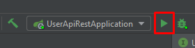
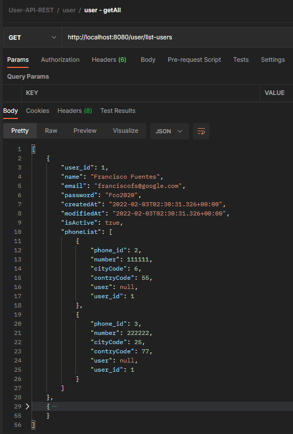

# API REST de manejo de usuarios

### ¿Cómo inciar la aplicación?

Con algún IDe, como IntellJ, o algún IDE de desarrollo, se puede iniciar la aplicación, como en el caso del IDE mencionado, es dar click en el botón play.

### ¿En qué puerto se ejecuta la aplicación?

puerto 8080. 

### ¿Donde puedo revisar la Base de Datos?

En la url http://localhost:8080/h2

* Driver Class: org.h2.Driver
* JBDC URL: jdbc:h2:mem:crm
* User name: cruduser
* Password: cruduser
* NOTA: La BD se creará al moento de iniciar la aplicación.

### ¿Cómo revisar los endpoints?

Utilizando PostMan, se puede revisar los endpoints, como en el siguiente ejemplo:

http://localhost:8080/user/list-users

http://localhost:8080/user/save

<a href="docs/ProyectoPostman/User-API-REST.postman_collection.json" download="User-API-REST.postman_collection.json">Descargar Proyecto postman</a>

